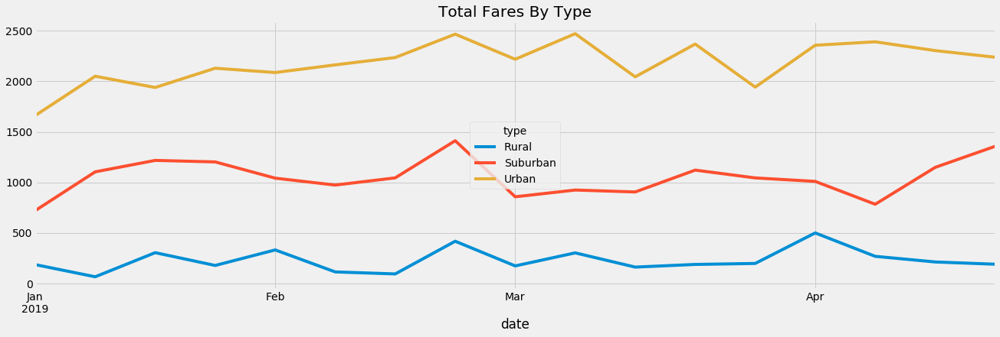

# PyBer_Analysis 
## Overview 
The goal of this analysis was to help PyBer, a ride sharing application, better understand and visualize how the data from various city types differ. With the information provided you can see the variance between city types, drivers, fares and more. 
## Ride Sharing Data 
* **Drivers by City Type** 
One of the most important factors is how many drivers are there per city type? We need to begin by using the correct code that will allow us to break this down. 

```
total_drivers_citytype = city_data_df.groupby(["type"]).sum()["driver_count"]
total_drivers_citytype
```

* **Fares by City Type**
Next, we need find the propper code to determine the cost of fares per city type: 

```
total_fare_citytype = pyber_data_df.groupby(["type"]).sum()["fare"]
total_fare_citytype
```

With the above information, as well as some additional key components, we were able to create a data frame that allows PyBer to better understand where their business is more prominent. 


## Ride Sharing Results 
Rather than showing each individual ride, we found it easier on the eyes to visualize results from January through April, and this is still a wide enough range to get a complete understanding of ride sharing needs. Below you will see the total rides by type.



## Ride Sharing Summary 
After reviewing this information, you can see that there is a higher demand for rides in the Urban areas. Since there are more people in urban areas, it leads to a higher demand for rides, which in turns leads to more drivers and a higher payout in ride fares. You can look at other companies such as Uber, Lyft and taxi companies to confirm this information. 
